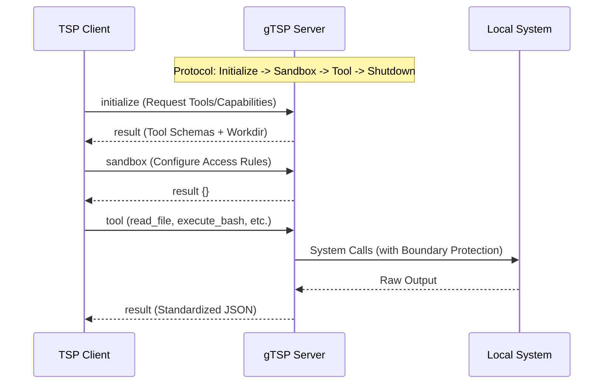

# gTSP

[English](README.md) | [中文](README.zh.md)

gTSP is a high-performance, zero-dependency reference implementation of the [Tool Server Protocol (TSP)](https://github.com/alexazhou/TSP). It provides standardized tool execution capabilities for Large Language Models (LLMs) via JSON over `stdio` or `WebSockets`.

### Core Features

- **Single-file Distribution**: Compiled into a single binary for easy deployment.
- **Cross-platform**: Supports Windows, macOS, and Linux.
- **Zero Dependencies**: No runtime or environment requirements.
- **Dual-mode Communication**: Supports both `stdio` and `WebSockets` transports.
- **Safety First**: Per-session sandbox with PathRule (allow/deny) matching.

### Interaction Protocol



### Quick Start

#### Compilation
```bash
go build -o gtsp src/main.go
```

#### Running
```bash
./gtsp --mode stdio
```

#### Interaction Example (stdin)
Send a JSON request to the program (newline required):
```json
{"id": "1", "method": "initialize", "input": {"protocolVersion": "0.3"}}
```

### Toolset (TSP v0.3)

| Method | Description | Key Parameters | Features |
| :--- | :--- | :--- | :--- |
| `list_dir` | Explore directory structure | `dir_path`, `recursive`, `depth` | Default ignores `.git`, returns rich metadata. |
| `read_file` | Read file with safety | `file_path`, `start_line`, `end_line` | **Line-based slicing**, 100KB limit, binary protection. |
| `write_file` | Atomic full write | `file_path`, `content` | **Atomic write** (temp file rename), auto `mkdir -p`. |
| `edit` | Precision string edit | `file_path`, `old_string`, `new_string` | **Safe replacement**, ensures unique match before applying. |
| `grep_search` | High-speed code search | `pattern`, `dir_path`, `fixed_strings` | Supports Regex/Literal, result truncation for context safety. |
| `glob` | File path matching | `pattern`, `path` | Fast lookup using glob patterns (e.g., `src/**/*.go`). |
| `execute_bash` | Execute system command | `command`, `task_timeout` | **Output truncation** (50KB/1000 lines), background task support. |

---

### Design Philosophy

The core philosophy of gTSP is **"Capability Isolation"**. By encapsulating complex system calls, path validations, and command execution logic within the Go layer, the Agent's logic layer remains pure and secure.

For the protocol definition, visit the [TSP Specification Repository](https://github.com/alexazhou/TSP).

### License

MIT
