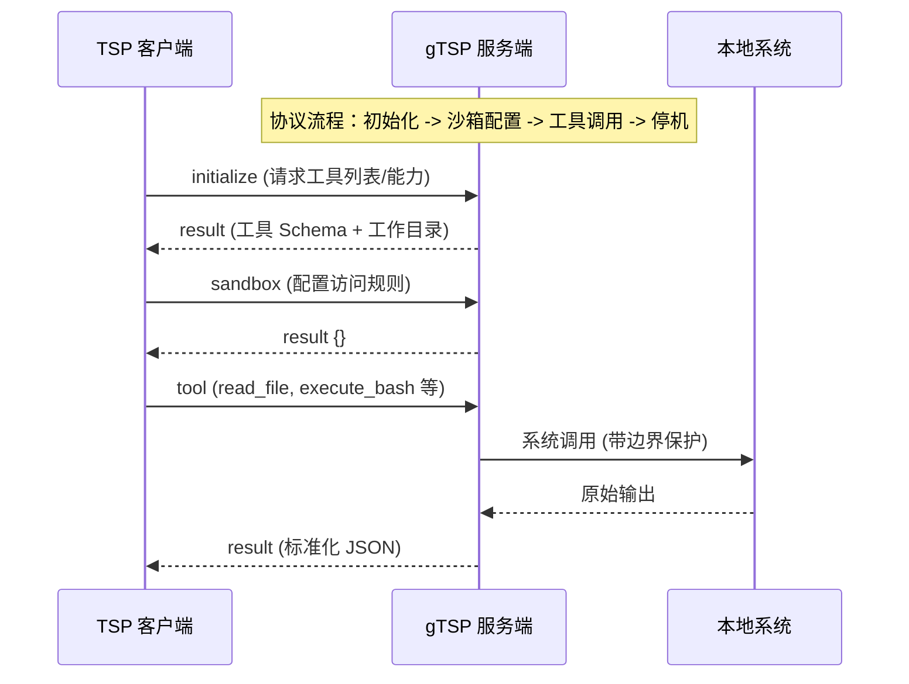

# gTSP

[English](README.md) | [中文](README.zh.md)

gTSP 是 [Tool Server Protocol (TSP)](https://github.com/alexazhou/TSP) 协议的高性能、零依赖参考实现。它通过 `stdio` 或 `WebSockets` 上的 JSON 通信，为大语言模型（LLM）提供标准化的工具执行能力。

### 核心特性

- **单文件分发**: 编译后为单个二进制文件，部署极其简便。
- **跨平台支持**: 完美支持 Windows, macOS 和 Linux 操作系统。
- **零依赖**: 无需任何运行时环境或外部依赖。
- **双模式通信**: 原生支持 `stdio` (标准输入输出) 和 `WebSockets` 两种通信协议。
- **安全优先**: 提供基于 `PathRule` (allow/deny) 匹配的会话级沙箱。

### 交互协议



### 快速开始

#### 编译
```bash
go build -o gtsp src/main.go
```

#### 运行
```bash
./gtsp --mode stdio
```

#### 交互示例 (stdin)
向程序发送一个 JSON 请求（需换行）：
```json
{"id": "1", "method": "initialize", "input": {"protocolVersion": "0.3"}}
```

### 工具集 (TSP v0.3)

| 方法名 | 说明 | 关键参数 | 特性 |
| :--- | :--- | :--- | :--- |
| `list_dir` | 浏览目录结构 | `dir_path`, `recursive`, `depth` | 默认忽略 `.git`，返回丰富元数据。 |
| `read_file` | 安全读取文件 | `file_path`, `start_line`, `end_line` | **行号切片读取**，100KB 自动截断，二进制保护。 |
| `write_file` | 原子全量写入 | `file_path`, `content` | **原子写入** (临时文件重命名)，自动 `mkdir -p`。 |
| `edit` | 手术刀式精准编辑 | `file_path`, `old_string`, `new_string` | **安全替换**，应用前校验唯一性。 |
| `grep_search` | 高性能代码搜索 | `pattern`, `dir_path`, `fixed_strings` | 支持正则/字面量，结果截断保护上下文。 |
| `glob` | 路径模式匹配 | `pattern`, `path` | 使用 Glob 语法快速定位文件。 |
| `execute_bash` | 执行系统命令 | `command`, `task_timeout` | **输出截断保护** (50KB/1000行)，支持后台运行。 |

---

### 设计理念

gTSP 的核心理念是**“能力隔离”**。通过将繁琐的系统调用、路径校验和命令执行逻辑封装在 Go 层，Agent 的逻辑层可以保持纯粹和安全。

关于协议定义的详细内容，请访问 [TSP 规范仓库](https://github.com/alexazhou/TSP)。

### 开源协议

MIT

